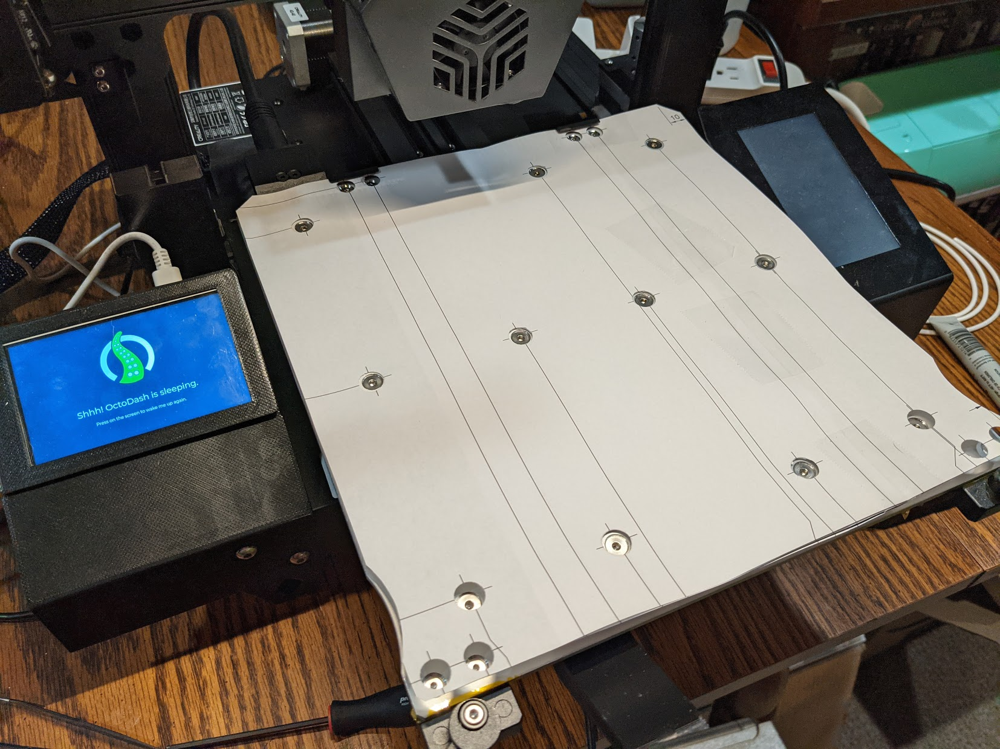

# CR6 Buildplate Punch Template

I bought a [WhamBam magnetic PEX buildplate](https://whambam3d.com/collections/frontpage/products/255-x-245-flexible-build-system-with-pre-installed-pex-build-surface) for my CR6 and wanted to punch holes in the magnetic sticker for the build plate screws.

This is NOT exact measurements for the screws, but it was good enough for my purposes.  

I used:
- [10mm punch for M4 screw holes](https://smile.amazon.com/gp/product/B07Q6J9GDN)
- [9mm punch for M3 screw holes](https://smile.amazon.com/gp/product/B07Q6KG2DM)

# Changelog

2021/01/24 - Add photos and readme

## Design

Autocad Fusion 360 

# Preview

